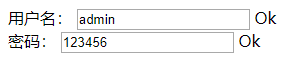

[TOC]

# Spring MVC学习

> Spring MVC属于Spring FrameWork的后续产品,是Spring FrameWork的一部分，是基于Java实现MVC的轻量级Web框架，Spring MVC 分离了控制器、模型对象、过滤器以及处理程序对象的角色，这种分离让它们更容易进行定制。

- 官方文档：[https://docs.spring.io/spring/docs/current/spring-framework-reference/web.html](https://docs.spring.io/spring/docs/current/spring-framework-reference/web.html)

- 狂神说：[https://www.cnblogs.com/hellokuangshen/tag/SpringMVC/](https://www.cnblogs.com/hellokuangshen/tag/SpringMVC/)

## 回顾Servlet

### 1. 测试环境

- 新建普通maven工程作为父工程，在父工程下导入依赖

```xml
<dependencies>
    <dependency>
        <groupId>org.springframework</groupId>
        <artifactId>spring-webmvc</artifactId>
        <version>5.2.2.RELEASE</version>
    </dependency>

    <dependency>
        <groupId>junit</groupId>
        <artifactId>junit</artifactId>
        <version>4.12</version>
    </dependency>

    <dependency>
        <groupId>javax.servlet</groupId>
        <artifactId>servlet-api</artifactId>
        <version>2.5</version>
    </dependency>

    <dependency>
        <groupId>javax.servlet.jsp</groupId>
        <artifactId>jsp-api</artifactId>
        <version>2.2</version>
    </dependency>

    <dependency>
        <groupId>javax.servlet</groupId>
        <artifactId>jstl</artifactId>
        <version>1.2</version>
    </dependency>
</dependencies>
```

- 添加web框架支持


- 父工程下新建module，并创建普通的Servlet类

```java
public class HelloServlet extends HttpServlet {
    @Override
    protected void doGet(HttpServletRequest req, HttpServletResponse resp) throws ServletException, IOException {
        //1. 获取前端参数
        String method = req.getParameter("method");
        if (method.equals("add")){
            req.getSession().setAttribute("msg","执行了add方法");
        }
        if (method.equals("delete")){
            req.getSession().setAttribute("msg","执行了delete方法");
        }
        //2. 调用业务层

        //3. 视图转发或重定向
        req.getRequestDispatcher("/WEB-INF/jsp/test.jsp").forward(req, resp);
    }

    @Override
    protected void doPost(HttpServletRequest req, HttpServletResponse resp) throws ServletException, IOException {
        doGet(req, resp);
    }
}
```

- 新建在`web/WEB-INF`目录下新建`jsp/test.jsp`

```jsp
<%@ page contentType="text/html;charset=UTF-8" language="java" %>
<html>
<head>
    <title>Title</title>
</head>
<body>
    ${msg}
</body>
</html>
```

- 配置`web.xml`

```xml
<?xml version="1.0" encoding="UTF-8"?>
<web-app xmlns="http://xmlns.jcp.org/xml/ns/javaee"
         xmlns:xsi="http://www.w3.org/2001/XMLSchema-instance"
         xsi:schemaLocation="http://xmlns.jcp.org/xml/ns/javaee http://xmlns.jcp.org/xml/ns/javaee/web-app_4_0.xsd"
         version="4.0">

    <servlet>
        <servlet-name>hello</servlet-name>
        <servlet-class>com.springmvc.servlet.HelloServlet</servlet-class>
    </servlet>

    <servlet-mapping>
        <servlet-name>hello</servlet-name>
        <url-pattern>/hello</url-pattern>
    </servlet-mapping>
</web-app>
```

### 2. 安装Tomcat服务器

- 下载地址：[https://tomcat.apache.org/download-90.cgi](https://tomcat.apache.org/download-90.cgi)


- 双击下载下来的.exe文件


- Next


- I Agree


- Next


- Next


- 等待安装完成
- 测试

浏览器输入：[http://localhost:8080/](http://localhost:8080/)，显示下图，说明安装成功。


如果没有显示，可以进到安装目录的bin目录下，双击`startup.bat`。


双击后出现下图，先不要不关掉，再在浏览器中输入地址。


可能出现的问题：

- 出现中文乱码：


解决：打开安装目录的`conf/logging.properties`文件


找到如下代码：

```properties
java.util.logging.ConsoleHandler.level = FINE
java.util.logging.ConsoleHandler.formatter = org.apache.juli.OneLineFormatter
java.util.logging.ConsoleHandler.encoding = UTF-8
```

修改为：

```properties
java.util.logging.ConsoleHandler.level = FINE
java.util.logging.ConsoleHandler.formatter = org.apache.juli.OneLineFormatter
java.util.logging.ConsoleHandler.encoding = GBK
```

保存，重新启动`startup.bat`，即可。

### 3. IDEA中开启Tomcat

- 单击下面的`Add Configuration`


点了后，出现下图，选择到Tomcat的安装目录即可


### 4. 测试

在浏览器中输入：http://localhost:8080/hello，显示500


输入：http://localhost:8080/hello?method=add，显示：`执行了add方法`

输入：http://localhost:8080/hello?method=delete，显示：`执行了delete方法`

##   Hello Spring MVC

> 原理版这么写原生的，实际开发不会这么写。
>
> 原理：[https://blog.kuangstudy.com/index.php/archives/311/](https://blog.kuangstudy.com/index.php/archives/311/)

### 1. 测试环境

- 新建module,添加Web支持
- 配置web.xml

```xml
<?xml version="1.0" encoding="UTF-8"?>
<web-app xmlns="http://xmlns.jcp.org/xml/ns/javaee"
         xmlns:xsi="http://www.w3.org/2001/XMLSchema-instance"
         xsi:schemaLocation="http://xmlns.jcp.org/xml/ns/javaee http://xmlns.jcp.org/xml/ns/javaee/web-app_4_0.xsd"
         version="4.0">
    <!--配置DispatcherServlet，【核心】-->
    <servlet>
        <servlet-name>springmvc</servlet-name>
        <servlet-class>org.springframework.web.servlet.DispatcherServlet</servlet-class>
        <!--绑定spring的配置文件：【servlet-name】-servlet.xml-->
        <init-param>
            <param-name>contextConfigLocation</param-name>
            <param-value>classpath:springmvc-servlet.xml</param-value>
        </init-param>
        <!--启动级别：1-->
        <load-on-startup>1</load-on-startup>
    </servlet>


    <servlet-mapping>
        <servlet-name>springmvc</servlet-name>
        <!-- / 与 /* 的区别-->
        <!--/ 匹配所有的请求；（不包括.jsp）浏览器中不需要输入hello.jsp，直接hello-->
        <!--/* 匹配所有的请求；（包括.jsp）-->
        <url-pattern>/</url-pattern>
    </servlet-mapping>
</web-app>
```

- 配置Spring（`springmvc-servlet.xml`)

```xml
<?xml version="1.0" encoding="UTF-8"?>
<beans xmlns="http://www.springframework.org/schema/beans"
       xmlns:xsi="http://www.w3.org/2001/XMLSchema-instance"
       xsi:schemaLocation="http://www.springframework.org/schema/beans
        http://www.springframework.org/schema/beans/spring-beans.xsd">
    <!-- 可以省略下面这两个配置 -->
    <!--BeanNameUrl映射处理器-->
    <bean class="org.springframework.web.servlet.handler.BeanNameUrlHandlerMapping"/>
    <!--Controller适配处理器-->
    <bean class="org.springframework.web.servlet.mvc.SimpleControllerHandlerAdapter"/>

    <!--ViewResolver视图解析器-->
    <bean class="org.springframework.web.servlet.view.InternalResourceViewResolver">
        <!--前缀-->
        <property name="prefix" value="/WEB-INF/jsp/"/>
        <!--后缀-->
        <property name="suffix" value=".jsp"/>
    </bean>

</beans>

```

- 实现Controller接口

```java
import org.springframework.web.servlet.ModelAndView;
import org.springframework.web.servlet.mvc.Controller;

import javax.servlet.http.HttpServletRequest;
import javax.servlet.http.HttpServletResponse;

public class HelloController implements Controller {
    public ModelAndView handleRequest(HttpServletRequest httpServletRequest, HttpServletResponse httpServletResponse) throws Exception {
        ModelAndView modelAndView = new ModelAndView();

        //封装对象（模型和视图）
        modelAndView.addObject("msg", "HelloSpringMVC");
        modelAndView.setViewName("hello");  //: /WEB-INF/jsp/hello.jsp

        return modelAndView;
    }
}

```

- 把类注册到Spring容器中

```xml
<!--Handler，注意id，浏览器中就是输入 /helloController name是别名 -->
<bean id="helloController" class="com.springmvc.controller.controller.HelloController" name="/helloController"  />
```

> 注：定义name后，可以省略这两个配置 ：BeanNameUrl映射处理器和Controller适配处理器

- 编写hello.jsp

```jsp
<%@ page contentType="text/html;charset=UTF-8" language="java" %>
<html>
<head>
    <title>Title</title>
</head>
<body>
    ${msg}
</body>
</html>
```

### 2. 部署并运行

- 手动添加到打包（按下图的顺序操作）


- 重启Tomcat并运行

> 输入：http://localhost:8080/hello 回车

- 可能会出现404


解决：手动添加lib依赖，按下图顺序操作


- 重新运行Tomcat

>  输入：http://localhost:8080/helloController， 回车，运行成功，显示：`HelloSpringMVC`


- 可能出现404的另一种情况：


注意：下面的id要为`/helloController`，或者写成`helloController`，但要加上name属性定义别名为`helloController`，否则会出现上面的404

```xml
<!--Handler，注意id，浏览器中就是输入 /helloController name是别名 -->
<bean id="helloController" class="com.springmvc.controller.controller.HelloController" name="/helloController"  />
```

## 使用注解开发

### 1. 测试环境

- 新建module，并添加web支持
- 配置`web.xml`。配置基本固定，不用再改

```xml
<?xml version="1.0" encoding="UTF-8"?>
<web-app xmlns="http://xmlns.jcp.org/xml/ns/javaee"
         xmlns:xsi="http://www.w3.org/2001/XMLSchema-instance"
         xsi:schemaLocation="http://xmlns.jcp.org/xml/ns/javaee http://xmlns.jcp.org/xml/ns/javaee/web-app_4_0.xsd"
         version="4.0">

    <!--1.注册servlet-->
    <servlet>
        <servlet-name>SpringMVC</servlet-name>
        <servlet-class>org.springframework.web.servlet.DispatcherServlet</servlet-class>
        <!--通过初始化参数指定SpringMVC配置文件的位置，进行关联-->
        <init-param>
            <param-name>contextConfigLocation</param-name>
            <param-value>classpath:springmvc-servlet.xml</param-value>
        </init-param>
        <!-- 启动顺序，数字越小，启动越早 -->
        <load-on-startup>1</load-on-startup>
    </servlet>

    <!--所有请求都会被springmvc拦截 -->
    <servlet-mapping>
        <servlet-name>SpringMVC</servlet-name>
        <url-pattern>/</url-pattern>
    </servlet-mapping>

</web-app>
```

- 配置`springmvc-servlet.xml`。配置基本固定，不用再改

```xml
<?xml version="1.0" encoding="UTF-8"?>
<beans xmlns="http://www.springframework.org/schema/beans"
       xmlns:xsi="http://www.w3.org/2001/XMLSchema-instance"
       xmlns:context="http://www.springframework.org/schema/context"
       xmlns:mvc="http://www.springframework.org/schema/mvc"
       xsi:schemaLocation="http://www.springframework.org/schema/beans
        http://www.springframework.org/schema/beans/spring-beans.xsd
        http://www.springframework.org/schema/context
        https://www.springframework.org/schema/context/spring-context.xsd
        http://www.springframework.org/schema/mvc
        https://www.springframework.org/schema/mvc/spring-mvc.xsd">

    <!-- 自动扫描包，让指定包下的注解生效,由IOC容器统一管理 -->
    <context:component-scan base-package="com.springmvc.controller.controller"/>
    <!-- 让Spring MVC不处理静态资源 -->
    <mvc:default-servlet-handler />
    <!--支持mvc注解驱动-->
    <mvc:annotation-driven />

    <!-- 视图解析器 -->
    <bean class="org.springframework.web.servlet.view.InternalResourceViewResolver"
          id="internalResourceViewResolver">
        <!-- 前缀 -->
        <property name="prefix" value="/WEB-INF/jsp/" />
        <!-- 后缀 -->
        <property name="suffix" value=".jsp" />
    </bean>

</beans>
```

- 编写Controller

```java
import org.springframework.stereotype.Controller;
import org.springframework.ui.Model;
import org.springframework.web.bind.annotation.RequestMapping;

@Controller
@RequestMapping("/AnnotationController")
public class AnnotationController {

    //真实访问地址：项目名/AnnotationController/annotation
    @RequestMapping("/annotation")
    public String useAnnotation(Model model){
        //向模型中添加属性msg与值，可以在jsp页面取出渲染
        model.addAttribute("msg", "Use Annotation in SpringMVC");

        //返回视图的名字 /WEB-INF/jsp/annotation.jsp
        return "annotation";
    }
}
```

- 编写视图

```jsp
<%@ page contentType="text/html;charset=UTF-8" language="java" %>
<html>
<head>
    <title>Title</title>
</head>
<body>
    ${msg}
</body>
</html>
```

### 2. 打包并运行

- 打开Project Structure（File | Project Structure） (快捷键：Ctrl + Shift + Alt + S)，添加lib依赖


- 配置Tomcat打包


- 运行Tomcat，浏览器输入：http://localhost:8080/springmvc_03_annotation/AnnotationController/annotation

运行成功,显示msg：`Use Annotation in SpringMVC`

### 小结：

> 使用springMVC必须配置的三大件：
>
> **处理器映射器、处理器适配器、视图解析器**
>
> 通常，我们只需要**手动配置视图解析器**，而**处理器映射器**和**处理器适配器**只需要开启**注解驱动**即可，而省去了大段的xml配置

## Controller及RestFul风格

### 1. 测试环境

- 步骤同[使用注解开发1](###1. 测试环境)
- 代码：`web.xml`和`springmvc-servlet.xml`不变，jsp视图的代码不变，文件名为`test.jsp`

```java
//@Controller注解的类会自动添加到Spring上下文中
@Controller
public class ControllerTest1 {

    @RequestMapping("/t1")
    public String test1(Model model){
        model.addAttribute("msg", "test @Controller");
        return "test";  //test.jsp
    }

}
```

### 2. 部署与运行

- 操作同[使用注解开发2](###2. 打包并运行)

### 3. RESTful风格

> Restful就是一个资源定位及资源操作的风格。不是标准也不是协议，只是一种风格。基于这个风格设计的软件可以更简洁，更有层次，更易于实现缓存等机制。

- 功能：
  - 资源：互联网所有的事物都可以被抽象为资源
  - 资源操作：使用POST（添加）、DELETE（删除）、PUT（修改）、GET（查询），使用不同方法对资源进行操作。

- 常用注解：

  ```java
  //参数为访问地址
  @GetMapping("/restful/{a}/{b}")  
  @PostMapping("")
  @PutMapping("")
  @DeleteMapping("")
  
  //方法中的参数需要加上该注解：
  @PathVariable
  ```

- 测试

```xml
<?xml version="1.0" encoding="UTF-8"?>
<web-app xmlns="http://xmlns.jcp.org/xml/ns/javaee"
         xmlns:xsi="http://www.w3.org/2001/XMLSchema-instance"
         xsi:schemaLocation="http://xmlns.jcp.org/xml/ns/javaee http://xmlns.jcp.org/xml/ns/javaee/web-app_4_0.xsd"
         version="4.0">

    <servlet>
        <servlet-name>springmvc</servlet-name>
        <servlet-class>org.springframework.web.servlet.DispatcherServlet</servlet-class>
        <init-param>
            <param-name>contextConfigLocation</param-name>
            <param-value>classpath:springmvc-servlet.xml</param-value>
        </init-param>
        <load-on-startup>1</load-on-startup>
    </servlet>

    <servlet-mapping>
        <servlet-name>springmvc</servlet-name>
        <url-pattern>/</url-pattern>
    </servlet-mapping>

</web-app>
```

```xml
<?xml version="1.0" encoding="UTF-8"?>
<beans xmlns="http://www.springframework.org/schema/beans"
       xmlns:xsi="http://www.w3.org/2001/XMLSchema-instance"
       xmlns:context="http://www.springframework.org/schema/context"
       xmlns:mvc="http://www.springframework.org/schema/mvc"
       xsi:schemaLocation="http://www.springframework.org/schema/beans
        http://www.springframework.org/schema/beans/spring-beans.xsd
        http://www.springframework.org/schema/context
        https://www.springframework.org/schema/context/spring-context.xsd
        http://www.springframework.org/schema/mvc
        https://www.springframework.org/schema/mvc/spring-mvc.xsd">

    <context:component-scan base-package="com.springmvc.controller"/>
    <mvc:default-servlet-handler />
    <mvc:annotation-driven />

    <bean class="org.springframework.web.servlet.view.InternalResourceViewResolver"
          id="internalResourceViewResolver">
        <property name="prefix" value="/WEB-INF/jsp/" />
        <property name="suffix" value=".jsp" />
    </bean>

</beans>
```

```jsp
<%@ page contentType="text/html;charset=UTF-8" language="java" %>
<html>
<head>
    <title>Title</title>
</head>
<body>
    ${msg}
</body>
</html>
```

```java
@Controller
public class RestfulTest {

    @PostMapping("/restful/{a}/{b}")
    public String test(@PathVariable int a,@PathVariable int b, Model model){
        int res = a+b;
        model.addAttribute("msg", "结果1为："+res);
        return "test";
    }

    @GetMapping("/restful/{a}/{b}")
    public String test2(@PathVariable int a,@PathVariable String b, Model model){
        String res = a+b;
        model.addAttribute("msg", "结果2为："+res);
        return "test";
    }

}
```

```jsp
<%@ page contentType="text/html;charset=UTF-8" language="java" %>
<html>
  <head>
    <title>post</title>
  </head>
  <body>
  <form action="/springmvc_04_controller/restful/1/2" method="post">
    <input type="submit">
  </form>
  </body>
</html>
```

- 运行

> 浏览器输入：http://localhost:8080/springmvc_04_controller/restful/1/aaa
>
> 运行结果：结果2为：1aaa
>
> 浏览器输入：http://localhost:8080/springmvc_04_controller/
>
> 点击提交按钮：
>
> 运行结果：结果1为：3
>
> 浏览器地址变为：http://localhost:8080/springmvc_04_controller/restful/1/2

### 4. 接收前端数据

**4.1 提交的域名称和处理方法的参数名一致**

- 处理方法

```java
@Controller
@RequestMapping("/user")
public class UserController {

    @GetMapping("/t1")
    public String test1(String name, Model model){
        model.addAttribute("msg", name);
        System.out.println("接收前端数据："+name);
        return "test";
    }
}
```

- 测试

  - 测试一：

  浏览器输入：http://localhost:8080/springmvc_04_controller/user/t1?name=lexiaoyuan

  前端显示：lexiaoyuan

  后台输出：接收前端数据：lexiaoyuan
  - 测试二：http://localhost:8080/springmvc_04_controller/user/t1?username=lexiaoyuan

  浏览器输入：http://localhost:8080/springmvc_04_controller/user/t1?username=lexiaoyuan

  前端显示：  （空）

  后台输出：接收前端数据：null

- 解决上面测试二的问题（不一致）

**参数添加`@RequestParam("")`注解：**

```java
@GetMapping("/t1")
public String test1(@RequestParam("username") String name, Model model){
    model.addAttribute("msg", name);
    System.out.println("接收前端数据："+name);
    return "test";
}
```

重新发布，再来

- 测试二：http://localhost:8080/springmvc_04_controller/user/t1?username=lexiaoyuan

浏览器输入：http://localhost:8080/springmvc_04_controller/user/t1?username=lexiaoyuan

前端显示：lexiaoyuan

后台输出：接收前端数据：lexiaoyuan

**4.2 提交的是一个对象**

> 要求提交的表单域和对象的属性名一致 , 参数使用对象即可

- 实体类：

```java
public class User {
    private int id;
    private String name;
    private int age;

    public User() {
    }

    public User(int id, String name, int age) {
        this.id = id;
        this.name = name;
        this.age = age;
    }

    public int getId() {
        return id;
    }

    public void setId(int id) {
        this.id = id;
    }

    public String getName() {
        return name;
    }

    public void setName(String name) {
        this.name = name;
    }

    public int getAge() {
        return age;
    }

    public void setAge(int age) {
        this.age = age;
    }

    @Override
    public String toString() {
        return "User{" +
                "id=" + id +
                ", name='" + name + '\'' +
                ", age=" + age +
                '}';
    }
}
```

- 处理方法：

```java
@GetMapping("/t2")
public String test2(User user){
    System.out.println("接收前端数据："+user.toString());
    return "test";
}
```

- 测试：接收前端数据：
  - 测试一：

  浏览器输入：http://localhost:8080/springmvc_04_controller/user/t2?id=1&name=lexiaoyuan&age=21

  后台输出：接收前端数据：User{id=1, name='lexiaoyuan', age=21}

  - 测试二：

  浏览器输入：http://localhost:8080/springmvc_04_controller/user/t2?id=1&username=lexiaoyuan&age=21

  后台输出：接收前端数据：User{id=1, name='null', age=21}

> **说明：如果使用对象的话，前端传递的参数名和对象名必须一致，否则就是null。**

### 5. 乱码问题

- 在web目录下新建一个页面，这样可以直接访问得到。

```jsp
<%@ page contentType="text/html;charset=UTF-8" language="java" %>
<html>
<head>
    <title>Title</title>
</head>
<body>
    <form action="/springmvc_04_controller/e/t1" method="post">
        <input type="text" name="name">
        <input type="submit">
    </form>
</body>
</html>
```

- 编写对应处理的类

```java
@Controller
public class EncodingController {

    @PostMapping("/e/t1")
    public String test(String name, Model model) {
        System.out.println(name);
        model.addAttribute("msg", name);
        return "test";
    }
}
```

- 测试

> 在浏览器输入：http://localhost:8080/springmvc_04_controller/encodingForm.jsp
>
> 
>
> 输入汉字进行测试
>
> 点击提交按钮
>
> 前端显示乱码：
>
> 
>
> 后台输出也乱码：
>
> 说明乱码是发生在java层面。

- 解决

在`web.xml`中增加配置SpringMVC的乱码过滤器，重启Tomcat

```xml
<!--配置SpringMVC的乱码过滤器-->
<filter>
    <filter-name>encoding</filter-name>
    <filter-class>org.springframework.web.filter.CharacterEncodingFilter</filter-class>
    <init-param>
        <param-name>encoding</param-name>
        <param-value>utf-8</param-value>
    </init-param>
</filter>
<filter-mapping>
    <filter-name>encoding</filter-name>
    <url-pattern>/*</url-pattern>
</filter-mapping>
```

- 再测试

> 在浏览器输入：http://localhost:8080/springmvc_04_controller/encodingForm.jsp
>
> 
>
> 输入汉字进行测试
>
> 点击提交按钮
>
> 前端显示正常：`乐小猿`
>
> 后台输出也正常：`乐小猿`

## JSON

### 1. 简介

> JSON(JavaScript Object Notation) 是一种轻量级的数据交换格式。易于人阅读和编写。同时也易于机器解析和生成。

### 2. JSON 与 JS 对象的关系

很多人搞不清楚 JSON 和 JS 对象的关系，甚至连谁是谁都不清楚。其实，可以这么理解：

**JSON 是 JS 对象的字符串表示法，它使用文本表示一个 JS 对象的信息，本质是一个字符串。**

如

```javascript
var obj = {a: 'Hello', b: 'World'}; //这是一个对象，注意键名也是可以使用引号包裹的
var json = '{"a": "Hello", "b": "World"}'; //这是一个 JSON 字符串，本质是一个字符串
```

### 3. JSON 和 JS 对象互转

要实现从JSON字符串转换为JS对象，使用 JSON.parse() 方法：

```js
var obj = JSON.parse('{"a": "Hello", "b": "World"}'); //结果是 {a: 'Hello', b: 'World'}
```

要实现从JS对象转换为JSON字符串，使用 JSON.stringify() 方法：

```js
var json = JSON.stringify({a: 'Hello', b: 'World'}); //结果是 '{"a": "Hello", "b": "World"}'
```

**JSON 键值对**是用来保存 JavaScript 对象的一种方式，和 JavaScript 对象的写法也大同小异，键/值对组合中的键名写在前面并用双引号 "" 包裹，使用冒号 : 分隔，然后紧接着值：

### 4. 测试

新建一个module，添加web支持，在web目录下编写一个html文件，代码如下，直接在浏览器打开该文件，按F12，在控制台可看到输出。

```html
<!DOCTYPE html>
<html lang="en">
<head>
    <meta charset="UTF-8">
    <title>Title</title>
    <script>

        // 一个js对象
        var obj = {
            name: "乐小猿",
            age: "21",
            sex: "男"
        };

        console.log(obj);
        /*{name: "乐小猿", age: "21", sex: "男"}
        name: "乐小猿"
        age: "21"
        sex: "男"*/

        // 将一个js对象转为json格式的字符串
        var json = JSON.stringify(obj);

        console.log(json); //{"name":"乐小猿","age":"21","sex":"男"}

        //将一个json字符串转为js对象
        var obj2 = JSON.parse(json);

        console.log(obj2);
        /*{name: "乐小猿", age: "21", sex: "男"}
        name: "乐小猿"
        age: "21"
        sex: "男"*/


    </script>
</head>
<body>

</body>
</html>
```

###  5. Controller返回JSON数据

> 使用第三方工具，jackson、fastjson等。这里使用Jackson：[https://github.com/FasterXML/jackson-databind](https://github.com/FasterXML/jackson-databind)

- 首先导入Jackson的maven依赖

```xml
<dependencies>
    <!-- https://mvnrepository.com/artifact/com.fasterxml.jackson.core/jackson-databind -->
    <dependency>
        <groupId>com.fasterxml.jackson.core</groupId>
        <artifactId>jackson-databind</artifactId>
        <version>2.10.2</version>
    </dependency>
</dependencies>
```

- 配置`web.xml`

```xml
<servlet>
    <servlet-name>springmvc</servlet-name>
    <servlet-class>org.springframework.web.servlet.DispatcherServlet</servlet-class>
    <init-param>
        <param-name>contextConfigLocation</param-name>
        <param-value>classpath:springmvc-servlet.xml</param-value>
    </init-param>
    <load-on-startup>1</load-on-startup>
</servlet>

<servlet-mapping>
    <servlet-name>springmvc</servlet-name>
    <url-pattern>/</url-pattern>
</servlet-mapping>

<filter>
    <filter-name>encoding</filter-name>
    <filter-class>org.springframework.web.filter.CharacterEncodingFilter</filter-class>
    <init-param>
        <param-name>encoding</param-name>
        <param-value>utf-8</param-value>
    </init-param>
</filter>
<filter-mapping>
    <filter-name>encoding</filter-name>
    <url-pattern>/*</url-pattern>
</filter-mapping>
```

- 配置`springmvc-servlet.xml`

> **注意：**会出现JSON格式乱码问题，通过添加消息StringHttpMessageConverter转换配置来解决。【固定配置】

```xml
<?xml version="1.0" encoding="UTF-8"?>
<beans xmlns="http://www.springframework.org/schema/beans"
       xmlns:xsi="http://www.w3.org/2001/XMLSchema-instance"
       xmlns:context="http://www.springframework.org/schema/context"
       xmlns:mvc="http://www.springframework.org/schema/mvc"
       xsi:schemaLocation="http://www.springframework.org/schema/beans
        http://www.springframework.org/schema/beans/spring-beans.xsd
        http://www.springframework.org/schema/context
        https://www.springframework.org/schema/context/spring-context.xsd
        http://www.springframework.org/schema/mvc
        https://www.springframework.org/schema/mvc/spring-mvc.xsd">

    <context:component-scan base-package="com.springmvc.controller.controller"/>

    <!--统一解决JSON乱码问题：添加消息StringHttpMessageConverter转换配置-->
    <mvc:annotation-driven>
        <mvc:message-converters>
            <bean class="org.springframework.http.converter.StringHttpMessageConverter">
                <constructor-arg value="UTF-8"/>
            </bean>
            <bean class="org.springframework.http.converter.json.MappingJackson2HttpMessageConverter">
                <property name="objectMapper">
                    <bean class="org.springframework.http.converter.json.Jackson2ObjectMapperFactoryBean">
                        <property name="failOnEmptyBeans" value="false"/>
                    </bean>
                </property>
            </bean>
        </mvc:message-converters>
    </mvc:annotation-driven>

    <bean class="org.springframework.web.servlet.view.InternalResourceViewResolver"
          id="internalResourceViewResolver">
        <property name="prefix" value="/WEB-INF/jsp/" />
        <property name="suffix" value=".jsp" />
    </bean>

</beans>
```

- 新建一个普通的User类

```java
package com.springmvc.pojo;

public class User {
    private int id;
    private String name;
    private String email;

    public User() {
    }

    public User(int id, String name, String email) {
        this.id = id;
        this.name = name;
        this.email = email;
    }

    public int getId() {
        return id;
    }

    public void setId(int id) {
        this.id = id;
    }

    public String getName() {
        return name;
    }

    public void setName(String name) {
        this.name = name;
    }

    public String getEmail() {
        return email;
    }

    public void setEmail(String email) {
        this.email = email;
    }

    @Override
    public String toString() {
        return "User{" +
                "id='" + id + '\'' +
                ", name='" + name + '\'' +
                ", email='" + email + '\'' +
                '}';
    }
}
```

- 新建一个Controller，返回json数据

```java
@RestController //作用相当于@Controller+@ResponseBody ，类下面的所有方法都不走视图解析器
//@Controller
public class UserController {

    @GetMapping("/json/t1")
    //@ResponseBody   //方法不走视图解析器，直接返回字符串，配合@Controller
    public String objToJson() throws JsonProcessingException {
        //创建一个Jackson的对象映射器，用来解析数据
        ObjectMapper objectMapper = new ObjectMapper();

        User user = new User(1, "乐小猿", "111@qq.com");

        //将对象解析为json格式
        return objectMapper.writeValueAsString(user);
    }
}
```

> 补充两个注解：
>
> - `@RestController` //作用相当于`@Controller`+`@ResponseBody `，类下面的所有方法都不走视图解析器
>
> -  `@ResponseBody `  //方法不走视图解析器，直接返回字符串，配合`@Controller`
>
> 我们在前后端分离开发中，一般都使用 `@RestController `，十分便捷！

- 【不要忘记】在Project Structure中添加lib包,然后部署并运行。

- 测试：

> 浏览器输入：http://localhost:8080/springmvc_05_json/json/t1
>
> 【运行结果】（浏览器端直接显示）：{"id":1,"name":"乐小猿","email":"111@qq.com"}

### 6. 集合类型返回JSON

- Controller中增加一个方法

```java
@GetMapping("/json/t2")
public String listToJson() throws JsonProcessingException {
    //创建一个jackson的对象映射器，用来解析数据
    ObjectMapper mapper = new ObjectMapper();

    List<User> list = new ArrayList<User>();

    //创建一个对象
    User user1 = new User(1, "乐小猿", "111@qq.com");
    User user2 = new User(2, "乐小猿2", "222@qq.com");
    User user3 = new User(3, "乐小猿3", "333@qq.com");
    User user4 = new User(4, "乐小猿4", "444@qq.com");

    list.add(user1);
    list.add(user2);
    list.add(user3);
    list.add(user4);

    //将我们的对象解析成为json格式
    return mapper.writeValueAsString(list);
}
```

- 测试：

> 浏览器输入：http://localhost:8080/springmvc_05_json/json/t2
>
> 【运行结果】（浏览器端直接显示）：[{"id":1,"name":"乐小猿","email":"111@qq.com"},{"id":2,"name":"乐小猿2","email":"222@qq.com"},{"id":3,"name":"乐小猿3","email":"333@qq.com"},{"id":4,"name":"乐小猿4","email":"444@qq.com"}]

### 7. Date类型返回JSON

- Controller中增加一个方法

```java
@GetMapping("/json/t3")
    public String timeToJson() throws JsonProcessingException {

        ObjectMapper mapper = new ObjectMapper();

        /*使用纯java的方式设置日期格式*/
        /*Date date = new Date();
        SimpleDateFormat simpleDateFormat = new SimpleDateFormat("yyyy-MM-dd HH:mm:ss");
        return mapper.writeValueAsString(simpleDateFormat.format(date));*/

        /*修改Jackson的配置来设置日期格式*/
        //不使用时间戳的方式
        mapper.configure(SerializationFeature.WRITE_DATES_AS_TIMESTAMPS, false);

        Date date = new Date();
        SimpleDateFormat simpleDateFormat = new SimpleDateFormat("yyyy-MM-dd HH:mm:ss");

        //指定日期格式
        mapper.setDateFormat(simpleDateFormat);

        return mapper.writeValueAsString(date);
    }
```

- 测试：

> 浏览器输入：http://localhost:8080/springmvc_05_json/json/t3
>
> 【运行结果】（浏览器端直接显示）："2020-02-22 16:25:32"

### 8. 抽取工具类

每个方法中都要`new ObjectMapper();`和`return mapper.writeValueAsString();` 太麻烦。

- 抽取工具类：

```java
public class JsonUtil {

    public static String getJson(Object object, String datePattern) {
        ObjectMapper mapper = new ObjectMapper();

        //不使用时间戳的方式
        mapper.configure(SerializationFeature.WRITE_DATES_AS_TIMESTAMPS, false);

        //自定义日期格式
        SimpleDateFormat simpleDateFormat = new SimpleDateFormat(datePattern);

        //指定日期格式
        mapper.setDateFormat(simpleDateFormat);

        try {
            return mapper.writeValueAsString(object);
        } catch (JsonProcessingException e) {
            e.printStackTrace();
        }
        return null;
    }

    //重载
    public static String getJson(Object object) {
        return getJson(object, "yyyy-MM-dd HH:mm:ss");
    }
}
```

- 使用工具类

```java
//使用工具类
@GetMapping("/json/t4")
public String timeToJson2(){
    Date date = new Date();
    return JsonUtil.getJson(date, "yyyy-MM-dd HH:mm:ss");
}

@GetMapping("/json/t5")
public String listToJson2(){
    List<User> list = new ArrayList<User>();
    listUser(list);
    return JsonUtil.getJson(list);
}

//出现大量重复代码，写到一个方法里面
private void listUser(List<User> list) {

    User user1 = new User(1, "乐小猿", "111@qq.com");
    User user2 = new User(2, "乐小猿2", "222@qq.com");
    User user3 = new User(3, "乐小猿3", "333@qq.com");
    User user4 = new User(4, "乐小猿4", "444@qq.com");

    list.add(user1);
    list.add(user2);
    list.add(user3);
    list.add(user4);
}
```

- 测试：同上，效果是一样的。

### 9. fastjson

> 源码及文档：[https://github.com/alibaba/fastjson/wiki/Quick-Start-CN](https://github.com/alibaba/fastjson/wiki/Quick-Start-CN)
>
> fastjson是阿里巴巴的开源JSON解析库，它可以解析JSON格式的字符串，支持将Java Bean序列化为JSON字符串，也可以从JSON字符串反序列化到JavaBean。

- 导入maven依赖

```xml
<!-- https://mvnrepository.com/artifact/com.alibaba/fastjson -->
<dependency>
    <groupId>com.alibaba</groupId>
    <artifactId>fastjson</artifactId>
    <version>1.2.62</version>
</dependency>
```

- 新建一个Controller

```java
@RestController
public class FastJsonController {
    @GetMapping("/fastjson/t1")
    public String objToJson(){
        User user = new User(1, "乐小猿", "111@qq.com");
        return JSON.toJSONString(user);
    }
}
```

- 测试：

>  浏览器输入：http://localhost:8080/springmvc_05_json/fastjson/t1
>
> 【运行结果】（浏览器端直接显示）：{"email":"111@qq.com","id":1,"name":"乐小猿"}
>
> 效果是一样的，更简洁。

这种工具类，我们只需要掌握使用就好了，在使用的时候在根据具体的业务去找对应的实现。

## Ajax

> **AJAX = Asynchronous JavaScript and XML（异步的 JavaScript 和 XML）**

### 1. 环境搭建

- 新建module，添加web支持
- 配置`web.xml`和`springmvc-servlet.xml`

```xml
<?xml version="1.0" encoding="UTF-8"?>
<web-app xmlns="http://xmlns.jcp.org/xml/ns/javaee"
         xmlns:xsi="http://www.w3.org/2001/XMLSchema-instance"
         xsi:schemaLocation="http://xmlns.jcp.org/xml/ns/javaee http://xmlns.jcp.org/xml/ns/javaee/web-app_4_0.xsd"
         version="4.0">
    <servlet>
        <servlet-name>dispatcherServlet</servlet-name>
        <servlet-class>org.springframework.web.servlet.DispatcherServlet</servlet-class>
        <init-param>
            <param-name>contextConfigLocation</param-name>
            <param-value>classpath:springmvc-servlet.xml</param-value>
        </init-param>
        <load-on-startup>1</load-on-startup>
    </servlet>
    <servlet-mapping>
        <servlet-name>dispatcherServlet</servlet-name>
        <url-pattern>/</url-pattern>
    </servlet-mapping>

    <filter>
        <filter-name>encodingFilter</filter-name>
        <filter-class>org.springframework.web.filter.CharacterEncodingFilter</filter-class>
        <init-param>
            <param-name>encoding</param-name>
            <param-value>utf-8</param-value>
        </init-param>
    </filter>
    <filter-mapping>
        <filter-name>encodingFilter</filter-name>
        <url-pattern>/*</url-pattern>
    </filter-mapping>
</web-app>
```

```xml
<?xml version="1.0" encoding="UTF-8"?>
<beans xmlns="http://www.springframework.org/schema/beans"
       xmlns:xsi="http://www.w3.org/2001/XMLSchema-instance"
       xmlns:context="http://www.springframework.org/schema/context"
       xmlns:mvc="http://www.springframework.org/schema/mvc"
       xsi:schemaLocation="http://www.springframework.org/schema/beans
        http://www.springframework.org/schema/beans/spring-beans.xsd
        http://www.springframework.org/schema/context
        https://www.springframework.org/schema/context/spring-context.xsd
        http://www.springframework.org/schema/mvc
        https://www.springframework.org/schema/mvc/spring-mvc.xsd">
    <context:component-scan base-package="com.springmvc.controller"/>
    <mvc:default-servlet-handler/>
    <mvc:annotation-driven/>
</beans>
```

###  2. 了解`iframe`标签

- web目录下新建`iframe.html`

```html
<!DOCTYPE html>
<html lang="en">
<head>
    <meta charset="UTF-8">
    <title>iframe标签</title>
    <style>
        #show {
            width: 100%;
            height: 500px;
        }
    </style>
    <script>
        window.onload = function() {
            let btn = document.getElementById("btn");
            let tx = document.getElementById("tx");
            let show = document.getElementById("show");
            btn.onclick = function () {
                show.src = tx.value;
            }
        }
    </script>
</head>
<body>
    <div>
        <p>地址：</p>
        <p>
            <label for="tx"></label>
            <input type="text" id="tx">
            <button id="btn">提交</button>
        </p>
    </div>

    <div>
        <iframe id="show"></iframe>
    </div>
</body>
</html>
```

- 通过IDEA直接在浏览器中打开，

- 显示：


- 输入地址：http://www.lexiaoyuan.club/newera/#/，点击提交
- 显示：

### 3. 失去焦点发送请求

- 新建controller包，和`AjaxController.java`

```java
package com.springmvc.controller;

@RestController //方法不会走视图解析器，直接返回字符串
@RequestMapping("/ajax")
public class AjaxController {
    @GetMapping("/test1")
    public String ajaxTest1(){  //测试环境是否搭建成功
        return "hello ajax";
    }

    @PostMapping("/test2")
    public void ajaxTest2(String searchName, HttpServletResponse response) throws IOException {
        response.setHeader("Content-type", "text/html;charset=UTF-8");
        response.setCharacterEncoding("UTF-8");
        System.out.println("ajaxTest2=>searchName:"+searchName);
        if (searchName.contains("beta")) {
            response.getWriter().print("success:请求成功！"+searchName);
        } else {
            response.getWriter().print("error:请求失败！"+searchName);
        }
    }
}
```

- 下载`jquery.js`到本地，在web目录下新建statics目录，jquery.js放到里面
- 修改`index.jsp`。**（使用jQuery发送ajax请求）**

```jsp
<%@ page contentType="text/html;charset=UTF-8" language="java" %>
<html>
<head>
    <title>Ajax Test</title>
    <script src="${pageContext.request.contextPath}/statics/jquery.js"></script>
    <script>
      $(function () {
          $("#search-tx").blur(function () {
              $.post({
                  url: "${pageContext.request.contextPath}/ajax/test2",
                  data: {"searchName": $("#search-tx").val()},
                  success: function (data) {
                      $("#msg").html("data:"+data);
                  },
                  error: function (data) {
                      $("#msg").html("data:"+data);
                  }

              });
          });
      });
    </script>
</head>
<body>
    <input id="search-tx" type="text" placeholder="失去焦点发送请求">
    <span id="msg"></span>
</body>
</html>
```

- 打包到Tomcat，并添加lib包，运行

- 测试：浏览器输入：http://localhost:8080/springmvc_06_ajax/

  - 显示：
  - 输入：（包含`beta`字符串会请求成功）

  

  

  

### 4.请求用户信息

- 新增`User.java`

```java
package com.springmvc.pojo;

public class User {
    private int id;
    private String name;
    private String email;

    public User() {
    }

    public User(int id, String name, String email) {
        this.id = id;
        this.name = name;
        this.email = email;
    }

    public int getId() {
        return id;
    }

    public void setId(int id) {
        this.id = id;
    }

    public String getName() {
        return name;
    }

    public void setName(String name) {
        this.name = name;
    }

    public String getEmail() {
        return email;
    }

    public void setEmail(String email) {
        this.email = email;
    }

    @Override
    public String toString() {
        return "User{" +
                "id=" + id +
                ", name='" + name + '\'' +
                ", email='" + email + '\'' +
                '}';
    }
}
```

- `AjaxController.java`中新增方法处理请求

```java
@GetMapping("/user")
public List<User> ajaxGetUser(){
    List<User> userList = new ArrayList<User>();
    userList.add(new User(1, "lexiaoyuan", "111@11.com"));
    userList.add(new User(2, "lexiaoyuan-alpha", "222@22.com"));
    userList.add(new User(3, "lexiaoyuan-beta", "333@33.com"));
    return userList;
}
```

- 在web目录下新建`user.html`

```html
<!DOCTYPE html>
<html lang="en">
<head>
    <meta charset="UTF-8">
    <title>查看用户</title>
    <script src="statics/jquery.js"></script>
    <script>
        $(function () {
            $.get({
                url: "ajax/user",
                success: function (data) {
                    console.log(data);
                    let userData = "";
                    for (let i = 0; i < data.length; i++) {
                        userData += "<tr>\n" +
                            "<td>"+data[i].id+"</td>\n" +
                            "<td>"+data[i].name+"</td>\n" +
                            "<td>"+data[i].email+"</td>\n" +
                            "</tr>";
                    }
                    $("#user-info").html(userData);
                },
                error: function (status) {
                    alert("error:" + status);
                }
            });
        });

    </script>
</head>
<body>
<div>
    <table>
        <tr>
            <td>id</td>
            <td>name</td>
            <td>email</td>
        </tr>
        <tbody id="user-info">
        </tbody>
    </table>
</div>
</body>
</html>
```

- 浏览器输入：http://localhost:8080/springmvc_06_ajax/user.html
- 显示：


### 5. 用户名密码异步验证

- `AjaxController.java`中新增方法处理请求

```java
@PostMapping("/login")
public String login(String username,String password){
    String msg = null;
    if (username != null) {
        if ("admin".equals(username)) {
            msg = "Ok";
        } else {
            msg = "用户名错误";
        }
    }
    if (password != null) {
        if ("123456".equals(password)) {
            msg = "Ok";
        } else {
            msg = "密码错误";
        }
    }
    return msg;  //由于@RestController注解，将msg转成json格式返回，所以需要配置JSON乱码处理
}
```

- 在web目录下新增`login.html`

```html
<!DOCTYPE html>
<html lang="en">
<head>
    <meta charset="UTF-8">
    <title>登录</title>
    <script src="statics/jquery.js"></script>
    <script>
        $(function () {
           $("#username").blur(function () {
               $.post({
                   url: "ajax/login",
                   data : {
                       "username": $("#username").val()
                   },
                   success : function(data) {
                        console.log(data);
                        $("#username-msg").html(data);
                   },
                   error : function(status) {
                       $("#username-msg").html(status);
                   }
               });
           });

            $("#password").blur(function () {
                $.post({
                    url: "ajax/login",
                    data : {
                        "password": $("#password").val()
                    },
                    success : function(data) {
                        console.log(data);
                        $("#pwd-msg").html(data);
                    },
                    error : function(status) {
                        $("#pwd-msg").html(status);
                    }
                });
            });
        });
    </script>
</head>
<body>
    <div>
        <label for="username">用户名：</label>
        <input id="username" type="text">
        <span id="username-msg"></span>
        <br>
        <label for="password">密码：</label>
        <input id="password" type="text">
        <span id="pwd-msg"></span>
    </div>
</body>
</html>
```

- 中文出现乱码，修改`springmvc-servlet.xml`，配置JSON乱码处理

```xml
<mvc:annotation-driven>
    <mvc:message-converters>
        <bean class="org.springframework.http.converter.StringHttpMessageConverter">
            <constructor-arg value="UTF-8"/>
        </bean>
        <bean class="org.springframework.http.converter.json.MappingJackson2HttpMessageConverter">
            <property name="objectMapper">
                <bean class="org.springframework.http.converter.json.Jackson2ObjectMapperFactoryBean">
                    <property name="failOnEmptyBeans" value="false"/>
                </bean>
            </property>
        </bean>
    </mvc:message-converters>
</mvc:annotation-driven>
```

- 测试：
  - 浏览器输入：http://localhost:8080/springmvc_06_ajax/login.html
  - 显示：
  - 输入用户名和密码，输入框失去焦点时显示提示信息。
  - 
  - 

## 拦截器

> SpringMVC的处理器拦截器类似于Servlet开发中的过滤器Filter,用于对处理器进行预处理和后处理。开发者可以自己定义一些拦截器来实现特定的功能。
>
> **过滤器与拦截器的区别：**拦截器是AOP思想的具体应用。
>
> **过滤器**
>
> - servlet规范中的一部分，任何java web工程都可以使用
> - 在url-pattern中配置了/*之后，可以对所有要访问的资源进行拦截
>
> **拦截器**
>
> - 拦截器是SpringMVC框架自己的，只有使用了SpringMVC框架的工程才能使用
> - 拦截器只会拦截访问的控制器方法， 如果访问的是jsp/html/css/image/js是不会进行拦截的

### 1. 环境搭建

- 新建module，添加web支持
- 配置`web.xml`和`springmvc-servlet.xml`

```xml
<?xml version="1.0" encoding="UTF-8"?>
<web-app xmlns="http://xmlns.jcp.org/xml/ns/javaee"
         xmlns:xsi="http://www.w3.org/2001/XMLSchema-instance"
         xsi:schemaLocation="http://xmlns.jcp.org/xml/ns/javaee http://xmlns.jcp.org/xml/ns/javaee/web-app_4_0.xsd"
         version="4.0">
    <servlet>
        <servlet-name>dispatcherServlet</servlet-name>
        <servlet-class>org.springframework.web.servlet.DispatcherServlet</servlet-class>
        <init-param>
            <param-name>contextConfigLocation</param-name>
            <param-value>classpath:springmvc-servlet.xml</param-value>
        </init-param>
        <load-on-startup>1</load-on-startup>
    </servlet>
    <servlet-mapping>
        <servlet-name>dispatcherServlet</servlet-name>
        <url-pattern>/</url-pattern>
    </servlet-mapping>

    <filter>
        <filter-name>encodingFilter</filter-name>
        <filter-class>org.springframework.web.filter.CharacterEncodingFilter</filter-class>
        <init-param>
            <param-name>encoding</param-name>
            <param-value>utf-8</param-value>
        </init-param>
    </filter>
    <filter-mapping>
        <filter-name>encodingFilter</filter-name>
        <url-pattern>/*</url-pattern>
    </filter-mapping>
</web-app>
```

```xml
<?xml version="1.0" encoding="UTF-8"?>
<beans xmlns="http://www.springframework.org/schema/beans"
       xmlns:xsi="http://www.w3.org/2001/XMLSchema-instance"
       xmlns:context="http://www.springframework.org/schema/context"
       xmlns:mvc="http://www.springframework.org/schema/mvc"
       xsi:schemaLocation="http://www.springframework.org/schema/beans
        http://www.springframework.org/schema/beans/spring-beans.xsd
        http://www.springframework.org/schema/context
        https://www.springframework.org/schema/context/spring-context.xsd
        http://www.springframework.org/schema/mvc
        https://www.springframework.org/schema/mvc/spring-mvc.xsd">

    <context:component-scan base-package="com.springmvc.controller"/>
    <mvc:default-servlet-handler/>
    <mvc:annotation-driven>
        <mvc:message-converters>
            <bean class="org.springframework.http.converter.StringHttpMessageConverter">
                <constructor-arg value="UTF-8"/>
            </bean>
            <bean class="org.springframework.http.converter.json.MappingJackson2HttpMessageConverter">
                <property name="objectMapper">
                    <bean class="org.springframework.http.converter.json.Jackson2ObjectMapperFactoryBean">
                        <property name="failOnEmptyBeans" value="false"/>
                    </bean>
                </property>
            </bean>
        </mvc:message-converters>
    </mvc:annotation-driven>

</beans>
```

- 新建controller包和`InterceptorController.java`

```java
package com.springmvc.controller;

@RestController
public class InterceptorController {

    @GetMapping("/test")
    public String test() {
        System.out.println("InterceptorController==>test()方法执行了");
        return "测试环境";
    }
}
```

- 添加lib包，部署运行，环境成功，这里不测试了。

### 2. 实现拦截器

- 新建config包，`MyInterceptor.java`

```java
package com.springmvc.config;

public class MyInterceptor implements HandlerInterceptor {
    //在请求处理的方法之前执行
    //如果返回true执行下一个拦截器
    //如果返回false就不执行下一个拦截器
    public boolean preHandle(HttpServletRequest request, HttpServletResponse response, Object handler) throws Exception {
        System.out.println("=========方法执行前==========");
        return true;
    }

    //通常用于输出拦截日志
    //在请求处理方法执行之后执行
    public void postHandle(HttpServletRequest request, HttpServletResponse response, Object handler, ModelAndView modelAndView) throws Exception {
        System.out.println("=========方法执行后==========");
    }

    //在dispatcherServlet处理后执行,做清理工作.
    public void afterCompletion(HttpServletRequest request, HttpServletResponse response, Object handler, Exception ex) throws Exception {
        System.out.println("=========清理==========");
    }
}
```

- 在`springmvc-servlet.xml`中增加拦截器配置

```xml
<!--配置拦截器-->
<mvc:interceptors>
    <mvc:interceptor>
        <!--/** 包括路径及其子路径,例如：-->
        <!--/admin/* 拦截的是/admin/add等等这种 , /admin/add/user不会被拦截-->
        <!--/admin/** 拦截的是/admin/下的所有-->
        <mvc:mapping path="/**"/>
        <bean class="com.springmvc.config.MyInterceptor"/>
    </mvc:interceptor>
</mvc:interceptors>
```
- OK，重启Tomcat，访问：http://localhost:8080/springmvc_07_interceptor/test

- 后台输出：

  > =========方法执行前==========
  > InterceptorController==>test()方法执行了
  > =========方法执行后==========
  > =========清理==========

### 3. 验证用户登录（登录后才能访问首页）

- 在`index.jsp`中提供访问首页和登录的入口

```jsp
<%@ page contentType="text/html;charset=UTF-8" language="java" %>
<html>
  <head>
    <title>$Title$</title>
  </head>
  <body>
    <a href="${pageContext.request.contextPath}/user/home">首页</a>
    <a href="${pageContext.request.contextPath}/user/goLogin">登录</a>
  </body>
</html>
```

- 在`WEB-INF/jsp`目录下新建`home.jsp`和`login.jsp`

```jsp
<%@ page contentType="text/html;charset=UTF-8" language="java" %>
<html>
<head>
    <title>首页</title>
</head>
<body>
    <h3>首页</h3>
    <p>这里是首页的一些内容。。。</p>
    <p>欢迎你：${username}</p>
    <a href="${pageContext.request.contextPath}/user/logout">注销</a>
    <a href="${pageContext.request.contextPath}/index.jsp">返回index</a>
</body>
</html>
```

```jsp
<%@ page contentType="text/html;charset=UTF-8" language="java" %>
<html>
<head>
    <title>登录</title>
</head>
<body>
    <h3>登录</h3>
    <form action="${pageContext.request.contextPath}/user/login" method="post">
        <label for="username">用户名：</label>
        <input type="text" name="username" id="username">
        <label for="password">密码：</label>
        <input type="password" name="password" id="password">
        <input type="submit" value="登录">
    </form>
</body>
</html>
```

- 在`springmvc-servlet.xml`中配置视图解析

```xml
<bean id="internalResourceViewResolver" class="org.springframework.web.servlet.view.InternalResourceViewResolver">
    <property name="prefix" value="/WEB-INF/jsp/"/>
    <property name="suffix" value=".jsp"/>
</bean>
```

- 修改`InterceptorController.java`，增加请求方法

```java
@Controller
@RequestMapping("/user")
public class InterceptorController {

   /* @GetMapping("/test")
    @ResponseBody
    public String test() {
        System.out.println("InterceptorController==>test()方法执行了");
        return "测试环境";
    }
    */

    @GetMapping("/home")
    public String home(){
        return "home";  //home.jsp
    }

    @GetMapping("/goLogin")
    public String goLogin(){
        return "login";  //login.jsp
    }

    @PostMapping("/login")
    public String login(String username, String password, HttpSession session){
        System.out.println("username:"+username+",password:"+password);
        if ("admin".equals(username) && "123456".equals(password)) {
            session.setAttribute("username", username);
            return "redirect:/user/home";
        } else {
            return "redirect:/user/goLogin";
        }
    }

    @GetMapping("/logout")
    public String logout(HttpSession session) {
        session.removeAttribute("username");
        return "redirect:/index.jsp";
    }
}
```

- 在config包下新增拦截器`LoginInterceptor.java`

```java
package com.springmvc.config;

public class LoginInterceptor implements HandlerInterceptor {
    public boolean preHandle(HttpServletRequest request, HttpServletResponse response, Object handler) throws Exception {

        HttpSession session = request.getSession();

         /*====判断放行的情况====*/
        // 想要去登录的请求，放行
        if (request.getRequestURI().contains("goLogin")) {
            return true;
        }
        // 发起登录的请求，放行
        if (request.getRequestURI().contains("login")) {
            return true;
        }
        //登录成功，进入首页，放行
        if (session.getAttribute("username")!= null) {
            return true;
        }

        //第一次进入首页，上面的都不满足，转到登录页面
        request.getRequestDispatcher("/user/goLogin").forward(request, response);
        return false;
    }
}
```

- 在`springmvc-servlet.xml`中配置再配置一个拦截器

```xml
<mvc:interceptor>
    <!--拦截/user/下的所有请求-->
    <mvc:mapping path="/user/**"/>
    <bean class="com.springmvc.config.LoginInterceptor"/>
</mvc:interceptor>
```

- 测试：访问：http://localhost:8080/springmvc_07_interceptor/
- 显示：

- 点击<u>首页</u>链接，（这里是第一次点击首页），没有登录，不能访问，被拦截，跳转到登录页面：

- 输入用户名：admin，密码：123456，点击登录按钮，登录成功，显示：

- 点击<u>返回index</u>链接，显示：，再点击<u>首页</u>链接，（这里是登录之后再点击首页），可以访问，直接跳转到首页：

- 点击<u>注销</u>链接，返回到：，再点击首页链接，（这里是登录后注销了再点击首页），不能访问，跳转到登录页面：

> OK，拦截功能实现了，只有当用户登录后才能够访问首页！

## 文件上传和下载

> 如果想使用Spring的文件上传功能，则需要在上下文中配置MultipartResolver。
>
>  前端表单要求：为了能上传文件，必须将表单的method设置为POST，并将enctype设置为multipart/form-data。只有在这样的情况下，浏览器才会把用户选择的文件以二进制数据发送给服务器；

### 1. 环境搭建

- 新建module，添加web支持
- 配置`web.xml`和`springmvc-servlet.xml`

```xml
<?xml version="1.0" encoding="UTF-8"?>
<web-app xmlns="http://xmlns.jcp.org/xml/ns/javaee"
         xmlns:xsi="http://www.w3.org/2001/XMLSchema-instance"
         xsi:schemaLocation="http://xmlns.jcp.org/xml/ns/javaee http://xmlns.jcp.org/xml/ns/javaee/web-app_4_0.xsd"
         version="4.0">

    <servlet>
        <servlet-name>springmvc</servlet-name>
        <servlet-class>org.springframework.web.servlet.DispatcherServlet</servlet-class>
        <init-param>
            <param-name>contextConfigLocation</param-name>
            <param-value>classpath:springmvc-servlet.xml</param-value>
        </init-param>
        <load-on-startup>1</load-on-startup>
    </servlet>

    <servlet-mapping>
        <servlet-name>springmvc</servlet-name>
        <url-pattern>/</url-pattern>
    </servlet-mapping>

    <filter>
        <filter-name>encoding</filter-name>
        <filter-class>org.springframework.web.filter.CharacterEncodingFilter</filter-class>
        <init-param>
            <param-name>encoding</param-name>
            <param-value>utf-8</param-value>
        </init-param>
    </filter>
    <filter-mapping>
        <filter-name>encoding</filter-name>
        <url-pattern>/*</url-pattern>
    </filter-mapping>

</web-app>
```

```xml
<?xml version="1.0" encoding="UTF-8"?>
<beans xmlns="http://www.springframework.org/schema/beans"
       xmlns:xsi="http://www.w3.org/2001/XMLSchema-instance"
       xmlns:context="http://www.springframework.org/schema/context"
       xmlns:mvc="http://www.springframework.org/schema/mvc"
       xsi:schemaLocation="http://www.springframework.org/schema/beans
        http://www.springframework.org/schema/beans/spring-beans.xsd
        http://www.springframework.org/schema/context
        https://www.springframework.org/schema/context/spring-context.xsd
        http://www.springframework.org/schema/mvc
        https://www.springframework.org/schema/mvc/spring-mvc.xsd">

    <context:component-scan base-package="com.springmvc.controller"/>
    <mvc:default-servlet-handler />
    <mvc:annotation-driven />

    <bean class="org.springframework.web.servlet.view.InternalResourceViewResolver"
          id="internalResourceViewResolver">
        <property name="prefix" value="/WEB-INF/jsp/" />
        <property name="suffix" value=".jsp" />
    </bean>

</beans>
```

### 2. 上传文件

- 当前module的`pom.xml`中导入依赖

> **SpringMVC的文件上传需要依赖Apache Commons FileUpload的组件**

```xml
<!--文件上传-->
<dependency>
    <groupId>commons-fileupload</groupId>
    <artifactId>commons-fileupload</artifactId>
    <version>1.3.3</version>
</dependency>
<!--servlet-api导入高版本的-->
<dependency>
    <groupId>javax.servlet</groupId>
    <artifactId>javax.servlet-api</artifactId>
    <version>4.0.1</version>
</dependency>
```

- 在`springmvc-servlet.xml`中配置bean：multipartResolver

```xml
<!--文件上传配置-->
<bean id="multipartResolver"  class="org.springframework.web.multipart.commons.CommonsMultipartResolver">
    <!-- 请求的编码格式，必须和jSP的pageEncoding属性一致，以便正确读取表单的内容，默认为ISO-8859-1 -->
    <property name="defaultEncoding" value="utf-8"/>
    <!-- 上传文件大小上限，单位为字节（10485760=10M） -->
    <property name="maxUploadSize" value="10485760"/>
    <property name="maxInMemorySize" value="40960"/>
</bean>
```

> **【注意！！！】这个bena的id必须为：multipartResolver ， 否则上传文件会报400的错误！在这里栽过坑,教训！**

- 在`index.jsp`中写前端上传表单

```jsp
<%@ page contentType="text/html;charset=UTF-8" language="java" %>
<html>
  <head>
    <title>文件上传和下载</title>
  </head>
  <body>
    <form action="${pageContext.request.contextPath}/upload" enctype="multipart/form-data" method="post">
      <input type="file" name="file"/>
      <input type="submit" value="上传">
    </form>
  </body>
</html>
```

- 新建controller包，`FileController.java`

```java
package com.springmvc.controller;

import java.io.*;
import java.net.URLEncoder;

@Controller
public class FileController {
    //@RequestParam("file") 将name=file控件得到的文件封装成CommonsMultipartFile 对象
    //批量上传CommonsMultipartFile则为数组即可
    @PostMapping("/upload")
    public String fileUpload(@RequestParam("file") CommonsMultipartFile file , HttpServletRequest request) throws IOException {

        //获取文件名 : file.getOriginalFilename();
        String uploadFileName = file.getOriginalFilename();

        //如果文件名为空，直接回到首页！
        if ("".equals(uploadFileName)){
            return "redirect:/index.jsp";
        }
        System.out.println("上传文件名 : "+uploadFileName);

        //上传路径保存设置
        String path = request.getServletContext().getRealPath("/upload");
        //如果路径不存在，创建一个
        File realPath = new File(path);
        if (!realPath.exists()){
            realPath.mkdir();
        }
        System.out.println("上传文件保存地址："+realPath);

        InputStream is = file.getInputStream(); //文件输入流
        OutputStream os = new FileOutputStream(new File(realPath,uploadFileName)); //文件输出流

        //读取写出
        int len;
        byte[] buffer = new byte[1024];
        while ((len=is.read(buffer))!=-1){
            os.write(buffer,0,len);
            os.flush();
        }
        os.close();
        is.close();
        return "redirect:/index.jsp";
    }

}
```

- 测试：访问：http://localhost:8080/springmvc_08_file/
- 显示：，
- 选择文件，点击上传按钮：后台输出：上传文件保存地址：`上传文件保存地址：

> 上传文件名 : MD语法文档.md
> 上传文件保存地址：D:\Spring\SpringProjects\springmvc_study\out\artifacts\springmvc_08_file_war_exploded\upload

- 在该目录下可以看到文件上传成功。

### 3. 上传文件方式二

- 在`FileController.java`中增加方法

```java
/*
 * 采用file.transferTo 来保存上传的文件
 */
@PostMapping("/upload2")
public String  fileUpload2(@RequestParam("file") CommonsMultipartFile file, HttpServletRequest request) throws IOException {

    //上传路径保存设置
    String path = request.getServletContext().getRealPath("/upload");
    File realPath = new File(path);
    if (!realPath.exists()){
        realPath.mkdir();
    }
    //上传文件地址
    System.out.println("上传文件保存地址："+realPath);

    //通过CommonsMultipartFile的方法直接写文件（注意这个时候）
    file.transferTo(new File(realPath +"/"+ file.getOriginalFilename()));

    return "redirect:/index.jsp";
}
```

- 修改`index.jsp`的上传请求接口

```jsp
<form action="${pageContext.request.contextPath}/upload2" enctype="multipart/form-data" method="post">
  <input type="file" name="file"/>
  <input type="submit" value="上传">
</form>
```

- 测试：和上面一样，成功！

### 4. 下载文件

- 在`FileController.java`中增加方法

```java
@GetMapping("/download")
public String downloads(HttpServletResponse response , HttpServletRequest request) throws Exception{
    //要下载的地址
    String  path = request.getServletContext().getRealPath("/upload");
    String  fileName = "MD语法文档.md";

    //1、设置response 响应头
    response.reset(); //设置页面不缓存,清空buffer
    response.setCharacterEncoding("UTF-8"); //字符编码
    response.setContentType("multipart/form-data"); //二进制传输数据
    //设置响应头
    response.setHeader("Content-Disposition",
            "attachment;fileName="+ URLEncoder.encode(fileName, "UTF-8"));

    File file = new File(path,fileName);
    //2、 读取文件--输入流
    InputStream input=new FileInputStream(file);
    //3、 写出文件--输出流
    OutputStream out = response.getOutputStream();

    byte[] buff =new byte[1024];
    int index;
    //4、执行 写出操作
    while((index= input.read(buff))!= -1){
        out.write(buff, 0, index);
        out.flush();
    }
    out.close();
    input.close();
    return null;
}
```

- 在`index.jsp`中增加下载链接

```jsp
<a href="${pageContext.request.contextPath}/download">下载文件</a>
```

- 测试：访问：http://localhost:8080/springmvc_08_file/
- 显示：

- 点击<u>下载文件</u>链接：

- 点击保存按钮，可以下载成功！